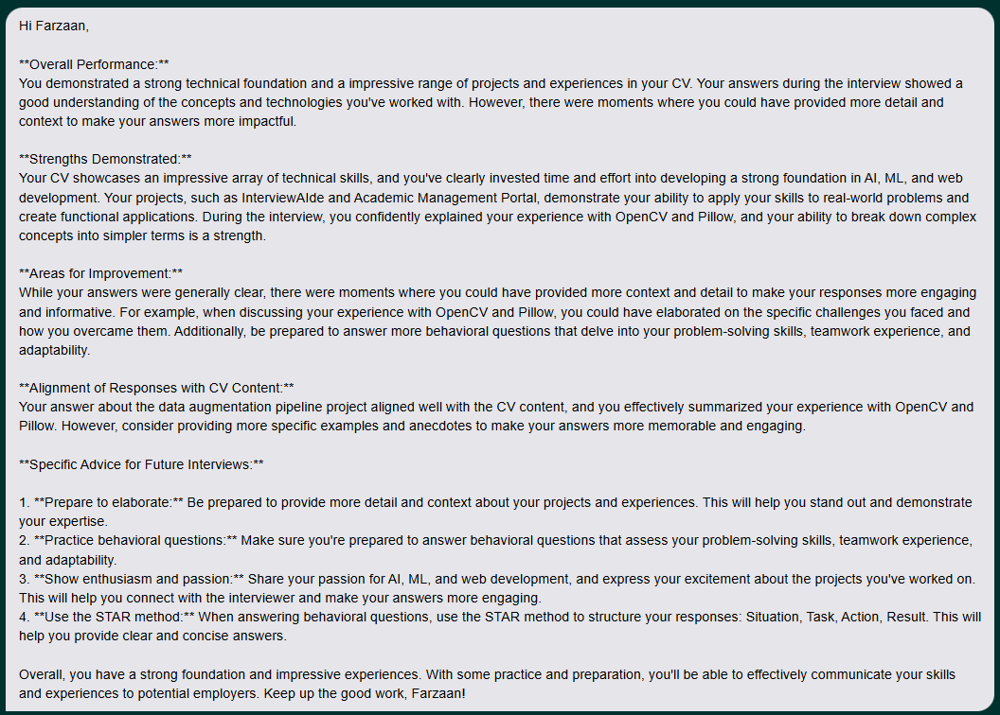

# InterviewAIde - AI Interview Assistant Portal

## Overview

InterviewAIde, the **AI Interview Assistant Portal**, is a web-based system that leverages AI models to generate interview questions, analyze CVs, and provide feedback. Built with **Flask** for backend logic, this tool helps facilitate interview processes by providing tailored questions and constructive feedback based on job domains and CV content.

Key features include:
- **Domain-specific interview questions** generated based on a user's input.
- **CV upload and analysis** to extract key details like skills, experience, and education.
- **Feedback generation** for interview answers, helping candidates improve.

This application integrates with **Groq API** for AI-driven analysis.

<p align="center">

</p>

## Features

- **Interview Question Generation:**
  - Generate interview questions for a given job domain or user background.
  
- **CV Upload & Analysis:**
  - Upload and analyze CV content to generate tailored interview questions.
  
- **Feedback Generation:**
  - After completing an interview, receive feedback based on responses.

## Requirements

### Software Requirements:
- **Python 3.x** (recommended version 3.8+)
- **Flask** (for web app functionality)
- **Requests** (for making HTTP requests)
- **Groq** (AI model interaction)
- **PyPDF2** (for extracting text from PDFs)

### Environment Setup:
- **GROQ API Key** 

## Usage

### 1. Chat-Based Interview

#### Description:
A text-based interview simulation where candidates receive and respond to domain-specific questions, providing detailed written answers for analysis and feedback.
<p align="center">

</p>

### 2. CV-Based Mode

#### Description:
An interview mode where questions are generated based on the candidate's uploaded CV, with a focus on their experience, skills, and education. Feedback is tailored to their CV content.
<p align="center">

</p>

### 3. Verbal/Voice Mode

#### Description:
A voice-enabled interview mode where candidates answer questions verbally. The system evaluates responses in real-time, offering feedback on spoken answers and assessing communication skills.

### 4. Feedback
The system provides personalized feedback by assessing strengths, pinpointing weaknesses, and offering actionable suggestions for improvement based on the candidate's responses, helping them grow and refine their skills.
<p align="center">

</p>


## Setup Instructions

### Step-by-Step Setup

1. **Clone the Repository:**
    ```bash
    git clone <REPO_URL>
    cd ai-interview-assistant-portal
    ```

2. **Create a Virtual Environment:**
    ```bash
    python -m venv .venv
    ```

3. **Activate the Virtual Environment:**
    - **Windows:**
      ```bash
      .venv\Scripts\activate
      ```
    - **Linux/Mac:**
      ```bash
      source .venv/bin/activate
      ```

4. **Install Dependencies:**
    ```bash
    pip install groq flask requests
    ```

5. **Set Your **GROQ_API_KEY**:**
    - **Windows:**
      ```bash
      $env:GROQ_API_KEY = "your-api-key-here"
      ```
    - **Linux/Mac:**
      ```bash
      export GROQ_API_KEY="your-api-key-here"
      ```

6. **Run the Flask API Server:**
    In the terminal, run:
    ```bash
    python api.py
    ```

    This will start the Flask server, which handles the backend API calls and routes.


## Contributing

We welcome contributions to this project! If you would like to contribute:
- Fork the repository.
- Clone your fork to your local machine.
- Create a new branch for your changes.
- Submit a pull request with a clear description of your changes.

## Copyright

This project is copyrighted and protected under intellectual property laws. Unauthorized use, reproduction, or distribution of this project is strictly prohibited without explicit permission from the author.

